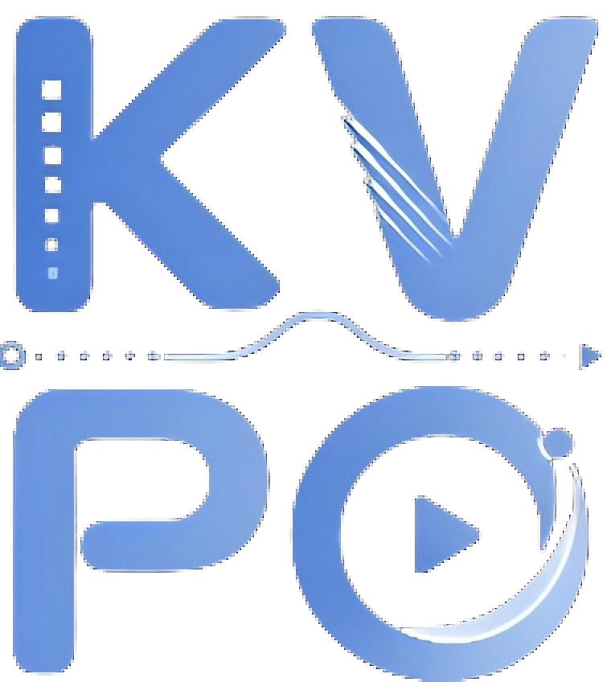
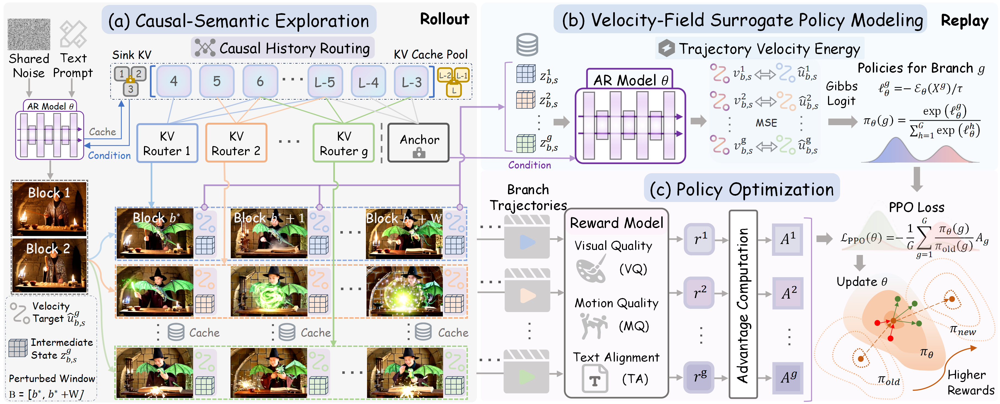

<div align="center">



<h1>KVPO: ODE-Native GRPO for Autoregressive Video Alignment via KV Semantic Exploration</h1>

Ruicheng Zhang<sup>1,3</sup>, Kaixi Cong<sup>1</sup>, Jun Zhou<sup>1</sup>, Zhizhou Zhong<sup>2,3</sup>, Zunnan Xu<sup>1</sup>, Shuiyang Mao<sup>3†</sup>, Wei Liu<sup>3</sup>, Xiu Li<sup>1‡</sup>

<sup>1</sup>Tsinghua University, <sup>2</sup>HKUST, <sup>3</sup>Video Rebirth

† Project leader. ‡ Corresponding author.

[](https://arxiv.org/abs/2605.14278)
[](https://richard-zhang-ai.github.io/KVPO-Project/)

</div>

---

## 🔬 Method overview

<p align="center">
  
</p>

<blockquote>
<p><strong>Overview of the KVPO training pipeline.</strong> Starting from a shared initial noise, the model first performs causal-semantic exploration via stochastic KV routing within a perturbed window to produce diverse candidate branches <strong>(a)</strong>. These branches are then replayed under the unperturbed deployment-time context, where the Trajectory Velocity Energy of each branch is computed and converted into Gibbs-form surrogate branch probabilities to measure their generation likelihood under the current policy <strong>(b)</strong>. Finally, the branches are scored by the reward model, and PPO updates the AR generator toward higher-reward behaviors via a contrastive flow-matching objective <strong>(c)</strong>.</p>
</blockquote>

---

## ⚙️ Setup

Clone the repository and enter the project root:

```bash
git clone https://github.com/Richard-Zhang-AI/KVPO.git
cd KVPO
```

### Environment

- **GPU**: NVIDIA H200
- **CUDA**: 12.8 (recommended)

```bash
conda env create -f environment_kvpo.yml
conda activate KVPO
```

If your CUDA driver or base image differs from the export, create the environment first, then align **PyTorch**, **CUDA**, and **flash-attention** builds with your hardware.

### Model checkpoints

Install the Hugging Face CLI and fetch the released KVPO weights:
[Hugging Face · Richard-ZZZZZ/KVPO-weight](https://huggingface.co/Richard-ZZZZZ/KVPO/tree/main).

```bash
pip install "huggingface_hub[cli]"
huggingface-cli download Richard-ZZZZZ/KVPO --local-dir checkpoints
```

Expected layout (paths referenced by the default configs):

```text
checkpoints/
  memflow/
    base.pt
    lora.pt
  longlive/
    models/
      longlive_base.pt
      lora.pt
```

**Wan2.1** backbones used by the generators:

```bash
huggingface-cli download Wan-AI/Wan2.1-T2V-1.3B --local-dir wan_models/Wan2.1-T2V-1.3B
huggingface-cli download Wan-AI/Wan2.1-T2V-14B --local-dir wan_models/Wan2.1-T2V-14B
```

### Reward models

Default training recipes may call **`video_hpsv3`** and/or **`videoalign_*`**. Place scorer checkpoints according to the KVPO release notes, or edit **`reward_components`** in the training YAML to match locally available scorers.

### Prompts

Prompts for online rollouts are distributed as a separate dataset:  
[Hugging Face · Richard-ZZZZZ/KVPO-prompt](https://huggingface.co/datasets/Richard-ZZZZZ/KVPO-prompt/tree/main).

```bash
huggingface-cli download Richard-ZZZZZ/KVPO-prompt \
  --repo-type dataset \
  --local-dir prompts
```

Point each training config’s **`data_path`** to the desired prompt file under `prompts/`.

---

## 🏋️ Training

### Configuration

Edit the YAML for the target backbone:

- `configs/train_kvpo_memflow.yaml`
- `configs/train_kvpo_longlive.yaml`

Frequently adjusted keys:

| Key | Role |
|-----|------|
| `num_gpus`, `gpu_ids` | Devices for the launcher |
| `data_path` | Prompt file for rollouts |
| `generator_ckpt`, `lora_ckpt` | Initialization weights |
| `K` | Number of KV exploration branches per prompt |
| `reward_components` | Reward mixture and weights |
| `output_dir` | Root directory for logs and saved states |

Launchers read `num_gpus` / `gpu_ids` from the YAML and invoke **`torchrun`** accordingly.

### Single-node

| Backend | Command |
|---------|---------|
| MemFlow | `bash train_kvpo_memflow.sh` |
| LongLive | `bash train_kvpo_longlive.sh` |

Direct entry (e.g., custom world size or resume path):

```bash
torchrun --nproc_per_node=8 train_kvpo_memflow.py \
  --config_path configs/train_kvpo_memflow.yaml \
  --resume logs/memflow/<run_name>/checkpoint_samples_XXXXXXX.pt
```

| Script | Config |
|--------|--------|
| `train_kvpo_memflow.py` | `configs/train_kvpo_memflow.yaml` |
| `train_kvpo_longlive.py` | `configs/train_kvpo_longlive.yaml` |

### Multi-node

```bash
bash train_kvpo_memflow_multinode.sh
bash train_kvpo_longlive_multinode.sh
```

Populate the **`multinode`** block in the YAML (SSH endpoints, master/worker roles). Minimal pattern:

```yaml
multinode:
  nodes:
    node0:
      ssh_host: master.example.com
      ssh_port: 22
      ssh_user: user
    node1:
      ssh_host: worker1.example.com
      ssh_port: 22
      ssh_user: user
  master: node0
  workers:
    - node1
```

Environment overrides (optional):

```bash
MASTER_NODE_ALIAS=node0 WORKER_NODE_ALIASES="node1 node2" \
  bash train_kvpo_longlive_multinode.sh
```

```bash
MASTER_HOSTNAME=master.example.com MASTER_SSH_PORT=22 MASTER_USER=user \
WORKER_HOSTNAMES="worker1.example.com worker2.example.com" \
WORKER_SSH_PORTS="22 22" WORKER_USERS="user" \
  bash train_kvpo_memflow_multinode.sh
```

> **Security:** password-based SSH is disabled by default. Prefer key-based auth; if required, set `SSH_PASSWORD`, `MASTER_PASSWORD`, or `WORKER_PASSWORDS` explicitly.

### Logging, outputs, and checkpoints

When **`group_outputs_by_run: true`**, each job writes under `output_dir` to a timestamped run folder, e.g.:

```text
logs/memflow/run_YYYYMMDD_HHMMSS_mmm/
  config_resolved.yaml
  train_log.jsonl
  checkpoint_samples_*.pt
  checkpoint_samples_*_ema.pt
```

If **`ema_decay > 0`**, prefer **`*_ema.pt`** for evaluation or downstream inference.

---

## 🎬 Inference

| Mode | Entry |
|------|-------|
| Single-prompt T2V | `bash inference.sh` |
| Interactive long-form generation | `bash interactive_inference.sh` |

Set checkpoint paths in **`configs/inference.yaml`** or **`configs/interactive_inference.yaml`** as needed.


---

## 📚 Citation

If you find our work useful in your research, please consider citing:

```bibtex
@misc{zhang2026kvpoodenativegrpoautoregressive,
      title={KVPO: ODE-Native GRPO for Autoregressive Video Alignment via KV Semantic Exploration}, 
      author={Ruicheng Zhang and Kaixi Cong and Jun Zhou and Zhizhou Zhong and Zunnan Xu and Shuiyang Mao and Wei Liu and Xiu Li},
      year={2026},
      eprint={2605.14278},
      archivePrefix={arXiv},
      primaryClass={cs.CV},
      url={https://arxiv.org/abs/2605.14278}, 
}
```
---

## 🙏 Acknowledgements

This codebase builds upon **Wan2.1**, **MemFlow**, **LongLive**, **HPS**, and **VideoAlign**. Please respect the licenses and terms of upstream projects and of all downloaded weights.

---

## 📜 License

The models in this repository are licensed under the **Apache 2.0 License**. We claim no rights over your generated contents, granting you the freedom to use them while ensuring that your usage complies with the provisions of this license. You are fully accountable for your use of the models, which must not involve sharing any content that violates applicable laws, causes harm to individuals or groups, disseminates personal information intended for harm, spreads misinformation, or targets vulnerable populations.
